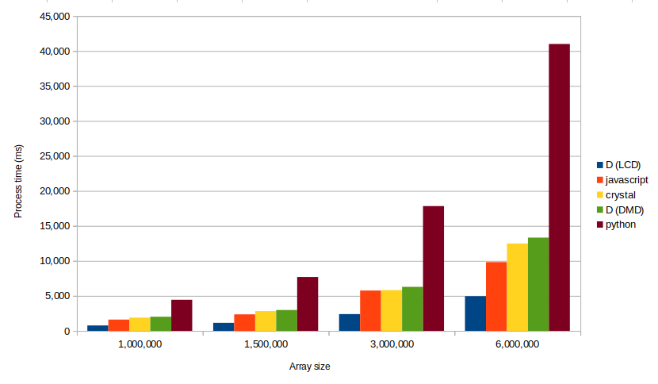

# expressive_sort

In this quora [answere](https://es.quora.com/Por-qu%C3%A9-la-mayor%C3%ADa-de-los-desarrolladores-estudian-solo-lenguajes-muy-simples-como-JavaScript-y-Python-en-lugar-de-aprender-un-lenguaje-verdadero-como-C-2/answer/Antonio-Cabrera-52) I wrote about javascript/python expressiveness vs Go/Rust/D/... performance.

As an example, I mentioned the "3 lines" haskell quick sort and wrote this javascript version

```javascript
const sorted = ([pivot, ...others]) => pivot === void 0 ? [] : [
  ...sorted(others.filter(n => n < pivot)),
  pivot,
  ...sorted(others.filter(n => n >= pivot))
];
```

This, of course, is not a real "quick sort" because the original one is an imperative algorithm thought for an "in place" sorting (without additional memory space allocation).  This is a functional oriented expression that exemplarizes how expressive a "functional" orientation can be (You "express" that the sorted version of an array is, given one of it's elements, the sorted version of the smaller ones, plus the item, plus the sorted version of the bigger ones).

As an enthusiastic newbie to the "[D](https://dlang.org)" programming language, I thought that D could affort this expressivenes too...

D has no support for destructuring as javascript has (remember de ```sorted([pivot, ...others])```), but it has **lambdas**, **map/filter/reduce** support, **array slices** and **array concatenation** that allows you to write easily a similar expression:

```d
T[] sorted(T)(T[] items)
{
  return items.length == 0 ? [] : 
    sorted(items[1 .. $].filter!(p => p < items[0]).array) ~ 
    items[0 .. 1] ~ 
    sorted(items[1 .. $].filter!(p => p >= items[0]).array);
}
```

> **note**: **sorted** is a *templated method* (**T** is the type of the elements of the array): "under the scenes", D compiler detects if the final used type is comparable (i.e.:  it is a class with a **opCmp** method, or it is a numerical type, or ...):  yo don't need to tell compiler that T extends something like *"IComparable"* because D libraries are not "interface" based:  D prefers to use "conventions" and check them using instrospection at compile time (D developers write compile-time code and run-time code at the same time:  D allows you to mix them naturally).

Seeing the similarities, as a developer, I can assume that javascript and D versions are doing the same "under the scenes":

* The ```[...array1, ...array2, ...array3]``` javascript is equivalent to the ```array1 ~ array2 ~ array3``` D code.  That is, a new array is being generated as a result of copying the elements of the original 3.
* The ```.filter!(...).array``` D code is using a "Range" to filter the elements and the ".array()" method to materialize the selected elements as an array.  Internally, it is similar to the javascript code where ```.filter(...)``` iterates and selects the resulting elements and finally materializes the array

## Wich one will perform better?

Here comes the surpriese (at least for me):  Javascript version performs better than D version (about **30% faster for 1_000_000 random Float64 numbers**).

* Javascript:  **1507 ms**
* D:  **2166 ms**

I decided to write similar code in other languajes and compare.

In python:

```python
def sorted(items):
  return [] if len(items) == 0 else \
    sorted([item for item in items[1:] if item < items[0]]) + \
    items[0:1] + \
    sorted([item for item in items[1:] if item >= items[0]])
```

The result? **5135 ms** (3,4 times slower than javascript)

In crystal:

```ruby
def sorted(a : Array(Float64)) : Array(Float64)
  return a.size == 0 ? [] of Float64  :
    sorted(a[1..].select { |x| x < a[0] }) +
    [ a[0] ] +
    sorted(a[1..].select { |x| x >= a[0] })
end
```

The result? **1853.0 ms** (14% faster than D, but 23% slower than Javascript).

The resulting final table for different sets of data



```
# Crystal
1.0M: 1853.0 ms
1.5M: 2865.0 ms
3.0M: 5994.0 ms
6.0M: 13144.0 ms
# D
1.0M: 2166 ms
1.5M: 3608 ms
3.0M: 7350 ms
6.0M: 15243 ms
# JavasScript
1.0M: 1507 ms
1.5M: 2165 ms
3.0M: 5655 ms
6.0M: 10776 ms
# Python
1.0M: 5135 ms
1.5M: 7939 ms
3.0M: 18908 ms
6.0M: 42458 ms
```

## Running the tests

### Prerequisites

All tests has been executed on a Ubuntu 20.04 linux.  
Tests require **Nodejs**, **Python3**, **DMD** compiler and **Crystal** compiler

**Javascript**:  Test runs on Node, I use node 12.20 (see [NodeSource distributions](https://github.com/nodesource/distributions/blob/master/README.md) for more information)

**Python**:  Ubuntu comes with **python 3** preinstalled.  Test the version with
```shell
$ pythong3 --version
```
**D**:  I use **DMD** and, particullary, the **rdmd** command that allows you to compile/exe on the fly a **.d** file.  DMD is in Ubuntu official repositories
```shell
$ sudo apt install dmd
...
$ dmd --version
DMD64 D Compiler v2.093.0
Copyright (C) 1999-2020 by The D Language Foundation, All Rights Reserved written by Walter Bright
$ rdmd
rdmd build 20200707
Usage: rdmd [RDMD AND DMD OPTIONS]... program [PROGRAM OPTIONS]...
Builds (with dependents) and runs a D program.
Example: rdmd -release myprog --myprogparm 5
```

**Crystal**: You must add the repository to your Ubuntu software sources and install it  (see [guide](https://crystal-lang.org/install/on_ubuntu/) for more information )

### Running the test

You can run all languajes tests using tests.sh

```shell
$ test.sh
```

Or test them individually

**D**
```shell
$ rdmd sorted.d --release
```
**Javascript**
```shell
$ node sorted.js
```
**Crystal**
```shell
$ crystal sorted.cr --release
```
**Python**
```shell
$ python3 sorted.py
```
